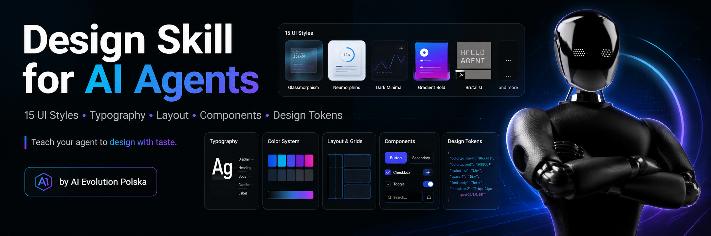
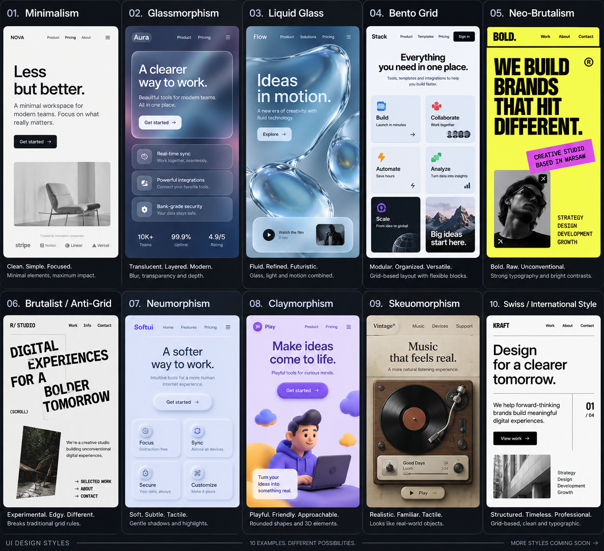

<div align="center">



# Agent Design Taste

### Design Intelligence for AI Agents

**Teach your coding agent *how to design* — not just how to code.**

[](LICENSE)
[](SKILL.md)
[](#the-15-styles)
[](https://github.com/aievolutionpl/agent-design-taste/actions/workflows/validate.yml)

**English** · [Polski](README.pl.md)

[Install](#install) · [For AI agents](#for-ai-agents) · [The workflow](#the-workflow) · [The 15 styles](#the-15-styles) · [Integrations](docs/INTEGRATIONS.md)

</div>

---

## Why this exists

AI agents ship functional apps in minutes. Then every one of them looks the same:

> purple gradient · glass cards · uniform 24px radius · Inter at every size ·
> three identical feature cards · a floating 3D blob · "Trusted by 50,000+ teams"
> · centered everything · a mobile layout that is just the desktop one, stacked

That is not a skill problem. It is a **knowledge problem**: nobody gave the agent
a design system or a way to decide. So it reaches for the statistically most
common pattern — which is exactly what makes the output look generated.

This repository gives the agent both: a real design system, and a process for
choosing inside it.

**The process is the product:**

```
Product → Audience → Style → Layout → Tokens → Render → Critique → Improve
```

Fifteen style libraries are the easy half. The half that matters is teaching an
agent to *observe, decide, and defend the decision*.

<div align="center">

⭐ **If this improves your agent's UI, star the repo** so more builders find it.

</div>

---

## Install

Clone it, then add one file so your agent finds it every session.

```bash
git clone https://github.com/aievolutionpl/agent-design-taste.git
```

<table>
<tr><th width="33%">One-shot</th><th width="33%">Project</th><th width="33%">Global</th></tr>
<tr valign="top">
<td>Try it once. Nothing to install — paste a prompt.</td>
<td>One project. Lives next to your code, committed with it.</td>
<td>Every project on your machine.</td>
</tr>
</table>

### A · One-shot — paste this prompt

No install. Works in Claude Code, Codex, Cursor, ChatGPT, anywhere.

```text
Use the Agent Design Taste system: https://github.com/aievolutionpl/agent-design-taste

Read AGENT-BOOTSTRAP.md first, then SKILL.md. Before writing any UI:

1. State the audience, product type, brand personality, content density,
   primary action and target emotion — in writing.
2. Use DECISION-MATRIX.md to choose ONE dominant style (plus at most one
   supporting style), and say why the runner-up loses.
3. Load ONLY that style's README.md and tokens.css. Do not load all 15.
4. If this project already has a design system, follow docs/PRECEDENCE.md:
   analyze it, map to it, adapt — never repaint it.
5. Build from tokens. Every color, space, radius and duration resolves to one.
6. Render at 1440 / 768 / 390 and look at it. Code review is not visual review.
7. Audit with ANTI-SLOP.md (zero BLOCKERS) and evaluation/DESIGN-TASTE-SCORE.md
   (score 75+), fix the two weakest areas, render again, then deliver.
```

### B · Project install

```bash
cd your-project
git clone --depth 1 https://github.com/aievolutionpl/agent-design-taste.git
bash agent-design-taste/scripts/install.sh --agent claude   # or codex, cursor,
                                                            # windsurf, copilot,
                                                            # gemini, agents, all
```

```
your-project/
├── agent-design-taste/     ← the system
├── CLAUDE.md               ← written by the installer: points the agent at it
├── DESIGN.md               ← written by the agent: your project's visual contract
└── src/
```

The installer never overwrites without `--force`, and `--dry-run` shows the plan.

### C · Global install

Keep one clone, use it everywhere.

```bash
git clone https://github.com/aievolutionpl/agent-design-taste.git ~/design/agent-design-taste

# Claude Code — a skill directory may be a symlink; loads only when relevant
ln -s ~/design/agent-design-taste ~/.claude/skills/agent-design-taste

# Codex — applies to every project you open
cp ~/design/agent-design-taste/adapters/AGENTS.md ~/.codex/AGENTS.md

# Gemini CLI
cp ~/design/agent-design-taste/adapters/GEMINI.md ~/.gemini/GEMINI.md
```

`git pull` updates every project at once.

> **Per-tool setup — Claude Code, Codex, Cursor, Windsurf, GitHub Copilot,
> Gemini CLI, Lovable, v0 — with the exact file paths each tool documents:
> [`docs/INTEGRATIONS.md`](docs/INTEGRATIONS.md)**

**Verify it worked.** Ask your agent, with no other context: *"What file do you
read first before changing UI here, and what are the canonical viewports?"*
Correct answer: `AGENT-BOOTSTRAP.md`, and **1440 / 768 / 390**.

---

## For AI agents

**If you are an AI agent reading this repository, this section is for you.**

1. **Do not generate UI yet.**
2. Read [`AGENT-BOOTSTRAP.md`](AGENT-BOOTSTRAP.md) — 75 lines, then
   [`SKILL.md`](SKILL.md).
3. Determine your **mode** (design / build / review / polish) and your
   **context profile** (LIGHT / STANDARD / FULL) →
   [`docs/CONTEXT-PROFILES.md`](docs/CONTEXT-PROFILES.md).
4. Analyze the existing project before changing anything. If it has a design
   system, run ANALYZE → MAP → ADAPT →
   [`docs/PRECEDENCE.md`](docs/PRECEDENCE.md).
5. **Preserve brand constraints.** Style tokens are defaults for greenfield
   work, not permission to repaint someone's product.
6. Choose **one** dominant style via
   [`DECISION-MATRIX.md`](DECISION-MATRIX.md). State why the runner-up loses.
7. **Load only what you need.** One style DNA is ~2.7k tokens. All fifteen are
   ~41k — and fourteen rejected styles in context make your output *worse*.
8. Build from tokens. Every value resolves to one.
9. **Render** at 1440 / 768 / 390 and look at it —
   `node scripts/screenshot.mjs <url-or-file>` does all four viewports and
   fails on mobile overflow.
10. **Score** with [`evaluation/DESIGN-TASTE-SCORE.md`](evaluation/DESIGN-TASTE-SCORE.md).
11. **Remove slop** with [`ANTI-SLOP.md`](ANTI-SLOP.md). Zero 🔴 BLOCKERS.
12. **Iterate**, then deliver.

Machine-readable routing, no prose parsing required:
[`design-taste.manifest.json`](design-taste.manifest.json) ·
[`styles/index.json`](styles/index.json)

---

## The workflow

```
        UNDERSTAND          audience · product · personality · density · emotion
             │
       CHOOSE STYLE         weighted scoring, veto gates, and why not the others
             │
        TYPOGRAPHY          roles before families — justified in one sentence
             │
          LAYOUT            a named pattern, not the same hero again
             │
          TOKENS            precedence-resolved, written into DESIGN.md
             │
           BUILD            constraint-first: every value is a token
             │
          RENDER            1440 · 768 · 390 — in a real browser, with your eyes
             │
           AUDIT            13 weighted categories, 8 hard blockers
             │
    REMOVE AI SLOP          BLOCKER · STRONG SMELL · MINOR SMELL
             │
          POLISH            rhythm · focus states · reduced motion · real content
```

Skipping UNDERSTAND, CHOOSE, RENDER or REMOVE SLOP is a failure — even when the
result looks good. **Looking good and being designed are different things.**

See the whole thing run on one brief:
[`docs/EXAMPLE-WORKFLOW.md`](docs/EXAMPLE-WORKFLOW.md)

---

## The 15 styles



| # | Style | Identity | Best for | Density |
|---|---|---|---|---|
| 01 | [Minimalism](styles/01-minimalism/) | Less, but better | B2B SaaS, fintech, premium | low–med |
| 02 | [Glassmorphism](styles/02-glassmorphism/) | Translucent. Layered. | Dev tools, dashboards | low–med |
| 03 | [Liquid Glass](styles/03-liquid-glass/) | Fluid light and motion | Consumer and creative apps | low–med |
| 04 | [Bento Grid](styles/04-bento-grid/) | Modular organised blocks | Feature-rich products | med–high |
| 05 | [Neo-Brutalism](styles/05-neo-brutalism/) | Bold, raw, unconventional | Youth brands, creator tools | low–med |
| 06 | [Brutalist / Anti-Grid](styles/06-brutalist-anti-grid/) | Break the grid on purpose | Portfolios, agencies, art | low |
| 07 | [Neumorphism](styles/07-neumorphism/) | Soft extruded surfaces | Decorative surfaces only ⚠️ | low |
| 08 | [Claymorphism](styles/08-claymorphism/) | Playful puffy 3D | Kids, education, wellness | low–med |
| 09 | [Skeuomorphism](styles/09-skeuomorphism-tactile/) | Looks like the real thing | Audio, instruments, finance | med–high |
| 10 | [Swiss / International](styles/10-swiss-international/) | Grid, type, order | Dev tools, data, corporate | med–high |
| 11 | [Editorial / Magazine](styles/11-editorial-magazine/) | Reads like a magazine | Media, long-form, luxury | med–high |
| 12 | [Maximalism](styles/12-maximalism/) | More is more | Fashion, events, culture | high |
| 13 | [Y2K / Retrofuturism](styles/13-y2k-retrofuturism/) | Chrome, bubble, optimism | Music, streetwear, gaming | med–high |
| 14 | [3D / Spatial UI](styles/14-3d-spatial-ui/) | Depth you can move through | Web3, launches, immersive | low–med |
| 15 | [Kinetic Typography](styles/15-expressive-kinetic-typography/) | Type as the interface | Portfolios, campaigns | low |

[**Live previews of all 15 example pages →**](https://aievolutionpl.github.io/agent-design-taste/) · [source](docs/index.html)

### What is inside every style folder

Not a mood board. A complete, self-contained design brief:

```
styles/10-swiss-international/
├── README.md              24-section Design DNA — philosophy, typography, grid,
│                          color, components, motion, responsive, accessibility,
│                          when-not-to-use, do/don't, anti-slop, signature move
├── tokens.css             canonical design tokens (light + dark)
├── tokens.json            same tokens for design tools and JS
├── tokens.tailwind.css    same tokens as a Tailwind v4 @theme block
├── prompts.md             ready prompts for Codex / Claude / Lovable / v0
└── example.html           a working page, single file, zero dependencies
```

`tokens.css` is the source of truth; the other two are generated from it and
verified in CI. **If the prose and a token disagree, the token wins.**

---

## What makes this different from a prompt library

<table>
<tr><th width="50%">A prompt library gives you</th><th width="50%">This gives your agent</th></tr>
<tr valign="top"><td>

Text to paste

</td><td>

A **decision process** with veto gates and weighted scoring

</td></tr>
<tr valign="top"><td>

A style, if you already know which one you want

</td><td>

A **reason** for the style — and an argument against the runner-up

</td></tr>
<tr valign="top"><td>

Everything, every time

</td><td>

**Context routing** — LIGHT / STANDARD / FULL, one style DNA at a time

</td></tr>
<tr valign="top"><td>

Output

</td><td>

Output, **rendered, scored, de-slopped and iterated**

</td></tr>
<tr valign="top"><td>

Whatever the model's defaults are

</td><td>

An explicit **precedence chain** that protects an existing brand

</td></tr>
</table>

### Precedence — the rule that keeps agents from wrecking your brand

```
brand & legal ▸ accessibility ▸ product needs ▸ style DNA ▸ repo tokens ▸ agent taste
```

Style tokens are **defaults for greenfield work**. When a project already has a
design system, the agent analyzes it, maps to it, and adapts — it does not
repaint it. And when a brand color fails contrast, the answer is to keep the
brand and derive an accessible variant inside the same hue family, not to swap
the brand out and not to ship failing text.

→ [`docs/PRECEDENCE.md`](docs/PRECEDENCE.md)

---

## Repository map

<details>
<summary><b>Everything, and when to load it</b></summary>

```
AGENT-BOOTSTRAP.md         entry point — 10 steps, and what NOT to load
SKILL.md                   the workflow, hard rules, knowledge priority
DECISION-MATRIX.md         11 signals → veto gates → weighted scoring
STYLE-COMBINATIONS.md      safe pairings and dangerous ones
LAYOUT-PATTERNS.md         43 patterns as a decision library
ANTI-SLOP.md               BLOCKER / STRONG SMELL / MINOR SMELL

docs/
  PRECEDENCE.md            conflict resolution · ANALYZE → MAP → ADAPT
  CONTEXT-PROFILES.md      LIGHT / STANDARD / FULL, with measured token costs
  INTEGRATIONS.md          per-agent installation, verified against each tool
  EXAMPLE-WORKFLOW.md      one brief, followed end to end
  STYLE-TEMPLATE.md        the required structure for style #16

styles/
  NN-name/                 15 self-contained Design DNAs
  index.json               machine-readable routing: ids, aliases, scoring, vetoes

accessibility/             the a11y floor + per-style failure modes
responsive/                the viewport ladder; recomposition, not stacking
typography/                roles, signals, metrics, language support, performance
visual-language/           photography, 3D, icons, texture, per-style art direction
motion/                    duration budgets, easing, reduced-motion
component-patterns/        19 components × 8 interaction states
layout-patterns/           grids, spacing scale, section anatomy
design-tokens/             token categories, naming, formats

evaluation/
  DESIGN-TASTE-SCORE.md    13 weighted categories + 8 hard blockers
  RENDERED-VERIFICATION.md code review is not visual review
  MODE-ROUTING.md          verb → mode → slice
  TASTE-LOOP.md            preference learning across sessions

prompts/
  DESIGN-CONTRACT.md       the DESIGN.md pattern
  PROMPT-LIBRARY.md        constraint-first prompt scaffolds

adapters/                  copy-paste files for each coding agent
scripts/                   gen_tokens · gen_manifest · validate · install
design-taste.manifest.json machine-readable repository manifest
```

</details>

<details>
<summary><b>Context cost — why the agent must not load everything</b></summary>

| Load | ~tokens |
|---|---|
| `AGENT-BOOTSTRAP.md` | 0.8k |
| LIGHT profile — a component fix | ~3k |
| STANDARD profile — a landing page | ~8k |
| FULL profile — a whole product | ~25k |
| One style DNA | ~2.7k |
| **All 15 style DNAs** | **~41k** ← never |
| Whole repository | ~101k |

Measure it yourself: `python3 scripts/validate.py --budget`

A style DNA already specifies fonts, scale, layout, color, components, motion,
accessibility and per-style anti-slop rules. **One style is a complete brief.
Fifteen is noise with a brief buried in it.**

</details>

<details>
<summary><b>Contributing and validation</b></summary>

```bash
python3 scripts/validate.py          # full structural check — what CI runs
python3 scripts/validate.py --budget # measured context cost per file
python3 scripts/gen_tokens.py        # regenerate tokens.json + tokens.tailwind.css
python3 scripts/gen_manifest.py      # regenerate styles/index.json + manifest
node    scripts/screenshot.mjs 10    # render a style at 1440/768/390/360
```

CI verifies that every style folder is complete, every required token category
exists (including `--shadow-focus`), every internal link resolves, every
`example.html` parses, all 15 DNAs share the 24-section architecture, and every
generated file is in sync with its source.

Adding style #16? [`CONTRIBUTING.md`](CONTRIBUTING.md) and
[`docs/STYLE-TEMPLATE.md`](docs/STYLE-TEMPLATE.md) have the full checklist.
The section reviewers read first is **"When NOT to use"** — a style with no
honest failure mode has not been thought about.

</details>

---

## Rules of the road

- Every style folder must answer **when NOT to use this style**.
- **Tokens are canonical.** If `README.md` and `tokens.css` disagree, the token
  wins and the README is a bug.
- Example pages are single-file HTML, zero dependencies, open in a browser.
- Prompts are tested patterns, not aspirations — concise and constraint-first.
- No unsupported claims: no invented citations, no unverified integrations,
  no statistics without a source. That rule applies to this repository too.

---

<div align="center">

## Built by AI Evolution Polska + AI Evolution Labs

**[AI Evolution Polska](https://www.aievolutionpolska.pl/)** — practical AI
education, workflows, agents and automation.
**AI Evolution Labs** — AI products, automation and creative technology.

[](https://github.com/aievolutionpl)

---

If Agent Design Taste helped your agent build better interfaces:

⭐ **Star this repository** &nbsp;·&nbsp; 🤝 **[Contributions welcome](CONTRIBUTING.md)** &nbsp;·&nbsp; 🐛 **[Open an issue](https://github.com/aievolutionpl/agent-design-taste/issues)**

<sub>MIT © AI Evolution Polska / AI Evolution Labs · The banner and style-overview
images above were generated by our AI agent — designed by an agent, for agents.</sub>

</div>
